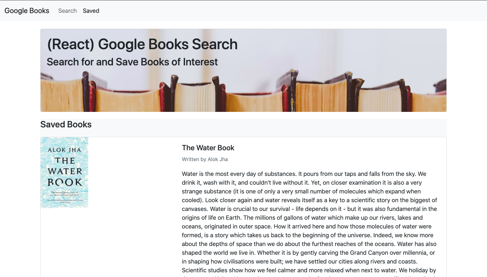

# Google Books Serch

## Description

A web application that queries and displays books that the user can save to view later or delete from their saved list.

## Technologies

* React.js
* Express.js
* JavaScript
* HTML
* CSS

## Installation

```
npm install express mongoose path
cd client
npm install axios bootstrap react-bootstrap react-router dom
cd ..
npm run start
```

## Goal of the Project

***Create a React-based Google Books Search app***

As a full stact web application, I created the front-end using React with the help of JavaScript, HTML, and CSS to achieve a responsive design. For complete functionality, Express.js was used to render the server-side code and data was stored and queried using MongoDB with Mongoose as the ODM.

## Usage

The following image is an example of the web application's functionality and appearance.



## URL

See the deployed web application [here](https://fast-brook-62371.herokuapp.com/)

## License

MIT License

Copyright (c) 2020 Dailey Kaze

Permission is hereby granted, free of charge, to any person obtaining a copy of this software and associated documentation files (the "Software"), to deal in the Software without restriction, including without limitation the rights to use, copy, modify, merge, publish, distribute, sublicense, and/or sell copies of the Software, and to permit persons to whom the Software is furnished to do so, subject to the following conditions:

The above copyright notice and this permission notice shall be included in all copies or substantial portions of the Software.

THE SOFTWARE IS PROVIDED "AS IS", WITHOUT WARRANTY OF ANY KIND, EXPRESS OR IMPLIED, INCLUDING BUT NOT LIMITED TO THE WARRANTIES OF MERCHANTABILITY, FITNESS FOR A PARTICULAR PURPOSE AND NONINFRINGEMENT. IN NO EVENT SHALL THE AUTHORS OR COPYRIGHT HOLDERS BE LIABLE FOR ANY CLAIM, DAMAGES OR OTHER LIABILITY, WHETHER IN AN ACTION OF CONTRACT, TORT OR OTHERWISE, ARISING FROM, OUT OF OR IN CONNECTION WITH THE SOFTWARE OR THE USE OR OTHER DEALINGS IN THE SOFTWARE.